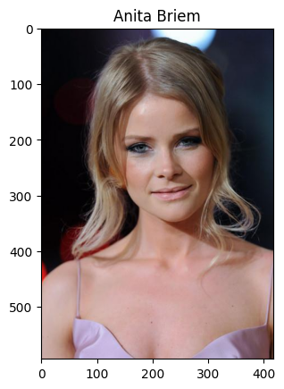
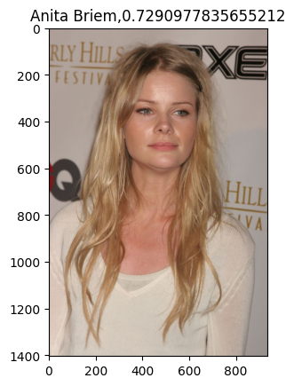

# Распознавание лиц различных по освещению и положению

В данном проекте реализована нейросетевая система, состоящая из двух частей: YOLOv3 и Facenet.

Ссылка на обучающий dataset: https://mmlab.ie.cuhk.edu.hk/projects/CelebA.html

## Рассматриваемые архитектуры:
- #### YOLOv3 (обучалась в проекте для детекции лиц)
<image src="yolo.jpg">

- #### Facenet (использовалась в виде рапознающей сети)
<image src="facenet.png">

## Технологический стек:
- PyTorch
- TensorFlow
- Matplotlib
- Keras
- Pandas

## Пример детектированного  изображения
<image src="pred.png">

Точность детекции  72,96%

## Пример распознавания
  
